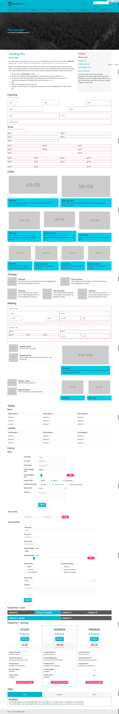

# Brash UI

> Brash doesn't give you BASSCSS type modularity. Brash tells you what markup to use. And you will like it.

---

### Common Questions

 - Where's the Java?. I am not including any Javascripts in this UI.
 - What's with the Outline? It's for debugging/building box sizing and a11y focus.

---

### Type

 - BODY starts the type scale at 15px
 - Define your Font Families in the `VARS`
 - No granular Type Components like blockquotes,list,etc

---

 ### Spacing

 - `VARS` has 1 Gutter variable to keep EVERYTHING EQUAL
 - Not a single `float:`

---

### Role Styling

 - `role=banner` equals the top "HEADER"
 - `role=navigation` equals the top "NAV"
 - `role=search` equals the top Search
 - `role=complimentary` equals the "Sidebar"

---

### Browser Support

> Native support. You're welcome to add your favorite Polyfill.

 - Windows 10
   - IE 13: Good
   - IE 12: Partial
   - IE 11: No
   - FF 48: Good
   - FF 45: Partial
   - CH 49: Good
   - OP 36: Good

 - Mac
   - Come on lets be honest everything works on the Mac  

---

### Screenshot

